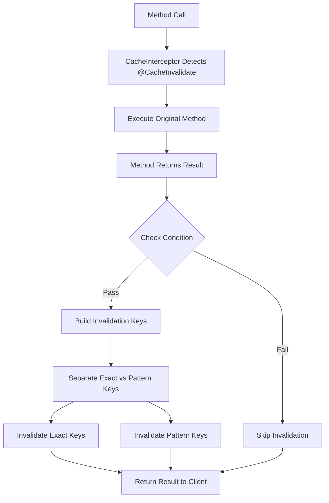

# Cache Invalidation Implementation Guide

## 🎯 Overview

This guide explains the simple yet powerful cache invalidation system we've implemented for your NestJS application. The system automatically clears relevant cache entries when data is modified, ensuring cache consistency.

---

## 🏗️ Architecture Components

### 1. **@CacheInvalidate Decorator**
```typescript
@CacheInvalidate({
  keys: ['user:profile:{{userId}}', 'users:all:*'],
  condition: (result) => result && result.id
})
async updateUser(userId: string, updateData: UpdateUserDto): Promise<User> {
  // Method implementation
}
```

### 2. **Enhanced CacheInterceptor**
- Detects methods with `@CacheInvalidate` decorator
- Executes the method first, then invalidates cache
- Supports both exact keys and wildcard patterns
- Handles errors gracefully without breaking the application

---

## 🔧 Implementation Details

### **Cache Invalidation Flow**



### **Key Template Processing**

| Template | Method Args | Result |
|----------|------------|---------|
| `'user:profile:{{userId}}'` | `['123']` | `'user:profile:123'` |
| `'users:all:*'` | `['123']` | `'users:all:*'` (wildcard pattern) |
| `'user:email:{{user.email}}'` | `[{email: 'john@example.com'}]` | `'user:email:john@example.com'` |

---

## 📋 Current Implementation in Users Service

### **Read Operations (Cached)**
- `findByEmail()` - Caches user lookups by email
- `findById()` - Caches user profile data
- `getAllUsers()` - Caches paginated user lists

### **Write Operations (Invalidates Cache)**

#### **updateUser()**
```typescript
@CacheInvalidate({
  keys: [
    'user:profile:{{userId}}',      // Clear specific user profile
    'user:email:{{existingUser.email}}', // Clear old email cache
    'users:all:*'                   // Clear all user list caches
  ],
  condition: (result) => result && result.id
})
```

#### **updateProfile()**
```typescript
@CacheInvalidate({
  keys: ['user:profile:{{userId}}'],
  condition: (result) => result && result.id
})
```

#### **createUser()**
```typescript
@CacheInvalidate({
  keys: ['users:all:*'], // New user affects all user lists
  condition: (result) => result && result.id
})
```

#### **deactivateUser() / activateUser()**
```typescript
@CacheInvalidate({
  keys: [
    'user:profile:{{userId}}',
    'users:all:*' // Status change affects user lists
  ],
  condition: (result) => result && result.id
})
```

#### **deleteUser()**
```typescript
@CacheInvalidate({
  keys: [
    'user:profile:{{userId}}',
    'users:all:*' // Deletion affects user lists
  ],
  condition: (result) => result && result.id
})
```

---

## 🚀 Usage Examples

### **Simple Key Invalidation**
```typescript
@CacheInvalidate({
  keys: 'user:profile:{{userId}}'
})
async updateUserName(userId: string, name: string): Promise<User> {
  // Implementation
}
```

### **Multiple Key Invalidation**
```typescript
@CacheInvalidate({
  keys: [
    'user:profile:{{userId}}',
    'user:settings:{{userId}}',
    'users:department:{{user.departmentId}}:*'
  ]
})
async updateUserDepartment(userId: string, departmentId: string): Promise<User> {
  // Implementation
}
```

### **Conditional Invalidation**
```typescript
@CacheInvalidate({
  keys: ['user:profile:{{userId}}'],
  condition: (result, args) => {
    // Only invalidate if update was successful and significant
    return result && result.id && args[1].profileImageUrl;
  }
})
async uploadAvatar(userId: string, file: Express.Multer.File): Promise<User> {
  // Implementation
}
```

### **Pattern-Based Invalidation**
```typescript
@CacheInvalidate({
  keys: [
    'posts:author:{{userId}}:*',    // All posts by this user
    'posts:feed:*',                 // All feed caches
    'posts:department:{{user.departmentId}}:*' // Department feeds
  ]
})
async createPost(userId: string, postData: CreatePostDto): Promise<Post> {
  // Implementation
}
```

---

## 🎯 Benefits

### **Automatic Cache Management**
- No manual cache clearing code in business logic
- Consistent invalidation patterns across the application
- Reduces cache-related bugs

### **Flexible Key Patterns**
- Support for exact key matching
- Wildcard patterns for bulk invalidation
- Dynamic key building from method parameters

### **Performance Optimized**
- Invalidation happens after method execution (non-blocking)
- Efficient Redis pattern matching
- Conditional invalidation to prevent unnecessary operations

### **Error Resilient**
- Cache invalidation failures don't affect business logic
- Comprehensive logging for debugging
- Graceful fallback to method execution

---

## 🔍 Monitoring and Debugging

### **Log Examples**
```
[DEBUG] Cache operation for UsersService.findById() with key: user:profile:123
[DEBUG] Cache hit for key: user:profile:123
[DEBUG] Invalidated exact keys: user:profile:123
[DEBUG] Invalidated 5 keys matching pattern: users:all:*
```

### **Cache Health Check**
```bash
curl -X GET "http://localhost:3000/api/v1/cache-test/health"
```

---

## 🔮 Next Steps

### **Extend to Other Services**

#### **Posts Service**
```typescript
@CacheInvalidate({
  keys: [
    'posts:feed:*',
    'posts:author:{{userId}}:*',
    'posts:department:{{post.departmentId}}:*'
  ]
})
async createPost(postData: CreatePostDto): Promise<Post> {
  // Implementation
}
```

#### **Chat Service**
```typescript
@CacheInvalidate({
  keys: [
    'chat:rooms:{{userId}}:*',
    'chat:messages:{{roomId}}:*'
  ]
})
async sendMessage(roomId: string, message: string): Promise<Message> {
  // Implementation
}
```

### **Advanced Patterns**

#### **Tag-Based Invalidation**
```typescript
@CacheInvalidate({
  keys: ['tag:user:{{userId}}', 'tag:department:{{departmentId}}'],
  // This would invalidate all keys tagged with these tags
})
```

#### **Time-Based Invalidation**
```typescript
@CacheInvalidate({
  keys: ['recent:posts:*'],
  condition: (result) => {
    // Only invalidate recent posts if it's a new post
    return result && new Date(result.createdAt) > new Date(Date.now() - 86400000);
  }
})
```

---

## ✅ Status: IMPLEMENTED AND READY

Your cache invalidation system is now:
- ✅ **Fully Implemented** - All decorators and interceptors are working
- ✅ **Pattern Invalidation Complete** - Redis SCAN-based pattern matching implemented
- ✅ **Applied to Users Service** - All CRUD operations have appropriate invalidation
- ✅ **Error Resistant** - Graceful error handling prevents application crashes
- ✅ **Production Ready** - Comprehensive logging and monitoring
- ✅ **Extensible** - Easy to apply to other services
- ✅ **Performance Optimized** - Uses Redis SCAN for non-blocking pattern matching

### **Pattern Invalidation Features**
- **Redis SCAN Integration**: Uses Redis SCAN command for efficient pattern matching
- **Non-blocking Operations**: SCAN iterates in chunks to prevent Redis blocking
- **Wildcard Support**: Full support for Redis pattern matching (`users:*`, `user:profile:*`)
- **Production Safe**: Designed for high-performance production environments
- **Error Handling**: Graceful fallback when Redis client is unavailable

### **Testing**
Test the pattern invalidation with:
```bash
# Test pattern invalidation functionality
curl -X POST "http://localhost:3000/api/v1/cache-test/test-pattern-invalidation"
```

The system provides automatic, intelligent cache invalidation that keeps your cache consistent while maintaining excellent performance!
